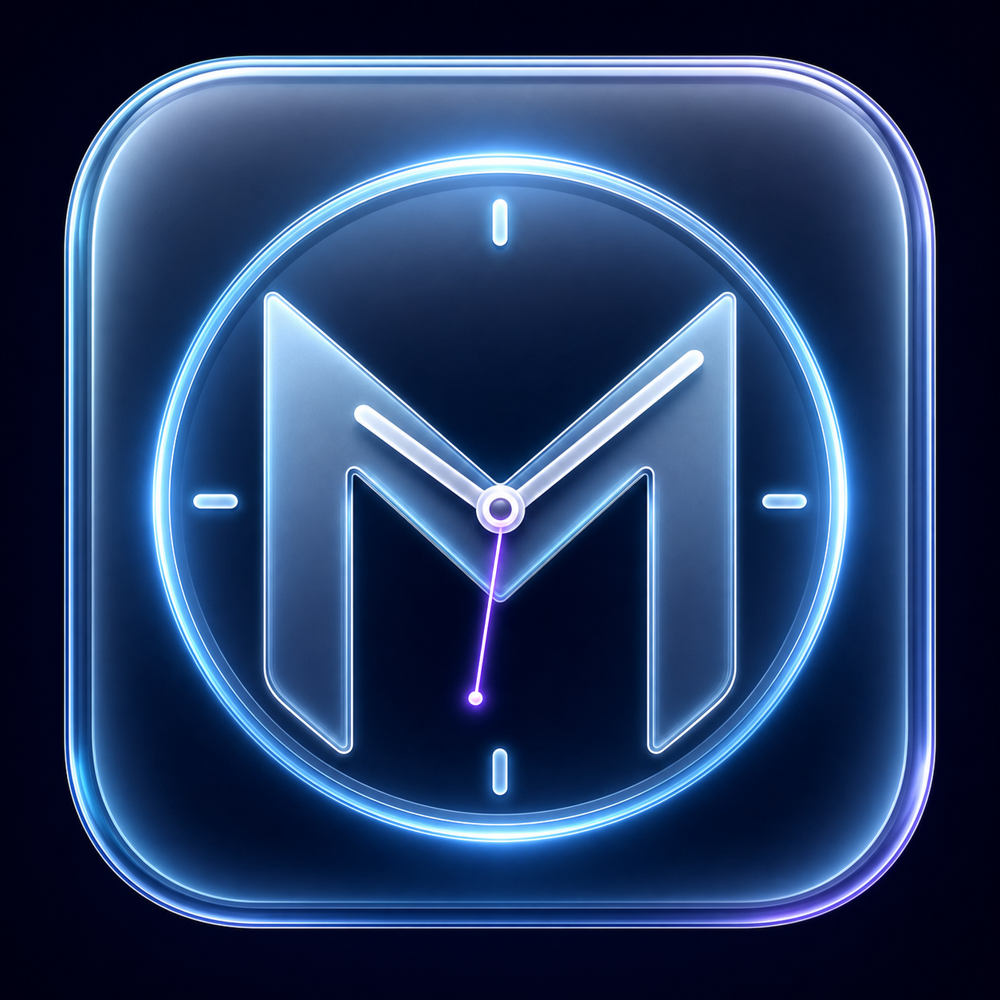

# MiniClock for Windows 10/11

A tiny transparent clock that stays above every window and lives quietly in the
notification area, similar to Lightshot or Ditto.

## Install it

Download and run **MiniClockSetup.exe** from the latest GitHub release. MiniClock
installs only for the current Windows user under `%LOCALAPPDATA%`, so it does not
request administrator approval.

The installer can optionally create a desktop shortcut and start MiniClock when
you sign in. It also adds MiniClock to the Start Menu and Windows' installed-apps
list for straightforward removal.

## Portable start

Double-click **Start MiniClock.cmd**. No installation or extra runtime is needed.

Drag the clock anywhere. Right-click either the clock or its notification-area
icon to open the menu.

## Controls

- Switch between 12-hour and 24-hour time
- Show or hide seconds and the date
- Choose size, opacity, color, and text shadow
- Switch between Glass, Midnight Neon, Warm Ember, Minimal, and Matrix themes
- Lock the clock in place
- Enable click-through mode
- Start automatically with Windows
- Hide/show from the notification-area icon
- Hold **Ctrl** and scroll over the clock for fine opacity adjustment

When click-through mode is active, use the notification-area icon to open the
menu again. Settings and screen position are saved in
`%APPDATA%\MiniClock\settings.json`.

## Uninstall

For an installed copy, use **Settings > Apps > Installed apps > MiniClock** or
the Start Menu uninstall shortcut. For a portable copy, exit MiniClock from its
notification-area menu and delete this folder.

## Build the installer

Install [Inno Setup 6](https://jrsoftware.org/isinfo.php), then compile
`MiniClock.iss`. The generated installer is written to
`dist\MiniClockSetup.exe`.
